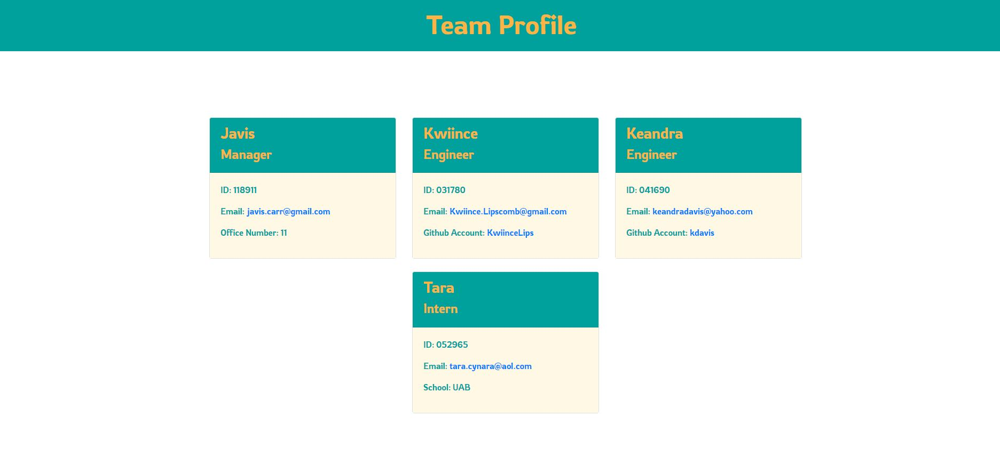

# Object-Oriented-Programming-Team-Profile-Generator

## Description

This purpose of this application is to generate a team profile using the input from the user with the Inquirer module using node.js. The information will be displayed on a newly created html file. This application was created using OOP and Jest.

## Table of Contents

* [Installation](#installation)
* [Usage](#usage)
* [License](#license)
* [Contributing](#contributing)
* [Test](#test)
* [Questions](#questions)

## Installation

User's should have the ability to clone the repository from Github and run the application using Node. If user does not have Node already, he/she will need to download Node. This application will require a file system(fs) and the inquirer module. Testing for the application is done so by using Jest.

## Usage

Run `node index.js` from your command line and answer questions prompted
  

You can view the video walk through here - [Vimeo](https://vimeo.com/666971028/ce116e49ab)

## License

This application is licensed by MIT

## Contributing

Contributors should refer to installation and usage sections.

## Test

Testing can be performed by running `npm test` with Jest in order to test constructors.

## Questions

Should you have any questions about this project, feel free to contact me at javis.carr@gmail.com or refer to my github at https://github.com/javiscarr
